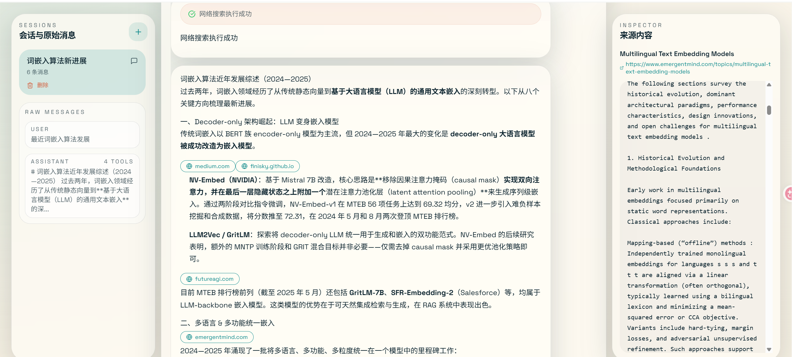

### 1. 环境要求

- Python 3.10+
- Node.js 15+
- npm

### 2. 启动后端

```bash
cd backend
uv sync
.venv\Scripts\activate
copy .env.example .env
```

补齐这些环境变量：

```env
# 默认聊天模型
SMART_LLM_API_KEY==your_key
FAST_LLM_API_KEY===your_key

# 默认阿里text-embedding-v3 embedding模型
EMBEDDING_API_KEY=your_key

# 联网
TAVILY_API_KEY=your_key
```

然后启动：

```bash
uvicorn app:app --host 0.0.0.0 --port 8002 --reload
```

### 3. 启动前端

```bash
cd frontend
npm install
npm run dev
```

打开 [http://localhost:3000](http://localhost:3000)。